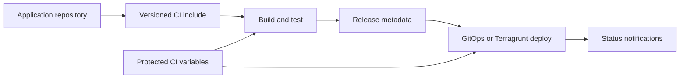

# GitLab CI building blocks

[](https://github.com/Alexandr-Zayats/devops-gitlab-ci/actions/workflows/ci.yml)
[](https://docs.gitlab.com/ci/)
[](LICENSE)

Reusable GitLab CI components for consistent build, test, release, deployment and notification workflows. The templates centralize delivery conventions while projects keep control of application-specific jobs and protected variables.

## Project profile

Best suited for platform teams creating a consistent delivery contract across
many application repositories. Pin the include to a reviewed tag or commit and
enable only the jobs required by the consuming project.

## Template catalogue

| Area | Examples |
|---|---|
| Bootstrap | shell, Node.js, Maven, Terraform, Terragrunt and Kubernetes setup |
| Build | Docker, Kaniko, Gradle, Node.js and PHP workflows |
| Test and quality | API, Gradle, Sonar, Checkov, approval and branch-status checks |
| Deployment | FluxCD, Terragrunt and review-environment lifecycle jobs |
| Release | image tags, release branches, repository tagging and hotfix metadata |
| Notifications | Slack and Jira integration templates |

## Layout

```text
gitlab-common/    Reusable templates grouped by pipeline responsibility
integration/      Example integration pipeline and release helper scripts
```

## Consumption

Pin the include to an immutable tag or commit:

```yaml
include:
  - project: your-group/devops-gitlab-ci
    ref: <version>
    file: /gitlab-common/main.yaml
```

Then select or extend only the jobs required by the consuming project. Review each template's expected variables before enabling it.

## Delivery model



## Security

- Credentials and endpoints must come from masked, protected CI/CD variables.
- Deployment jobs should use short-lived workload identity where available.
- Production jobs should be protected and require an explicit approval policy.
- Pin container images and external includes to reviewed versions.
- Never print credentials in helper scripts or job traces.

CI validates YAML syntax, including GitLab custom tags, and runs shell syntax checks for integration helpers. See [SECURITY.md](SECURITY.md) and [CONTRIBUTING.md](CONTRIBUTING.md). Licensed under the [MIT License](LICENSE).
